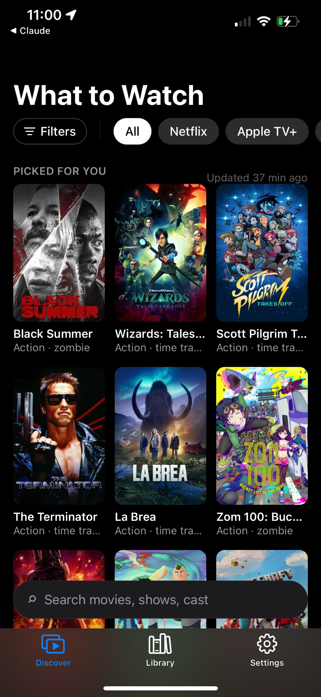
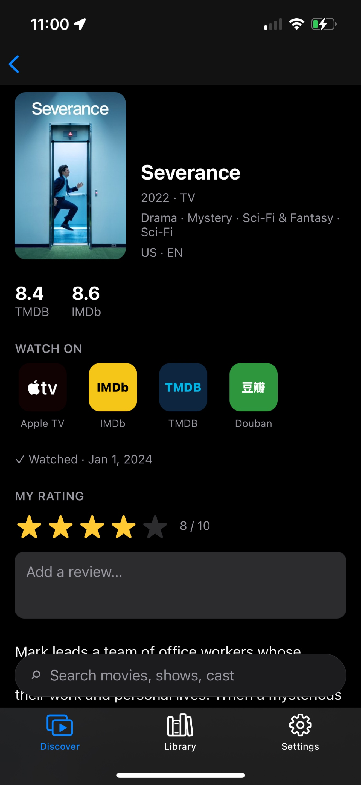
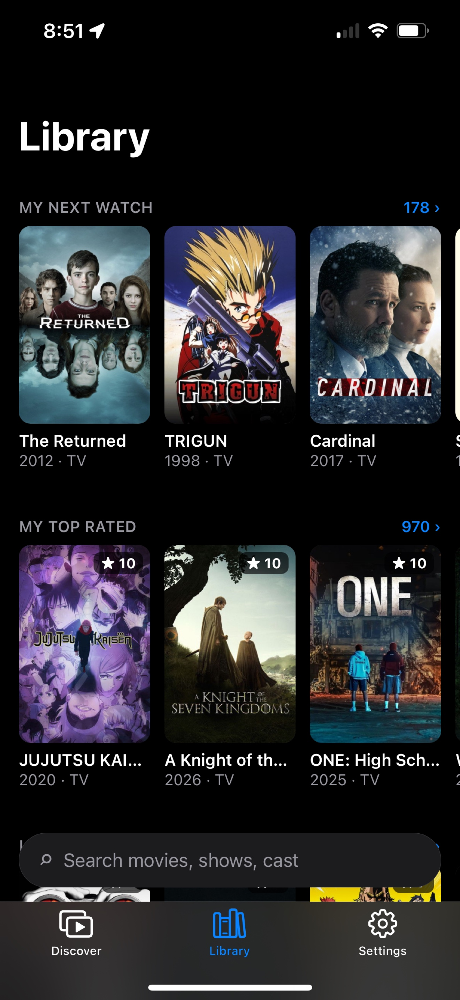
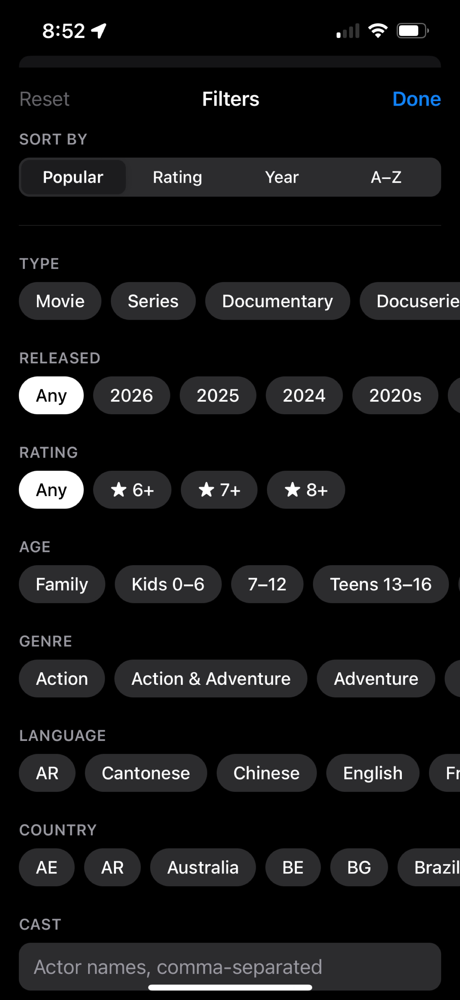
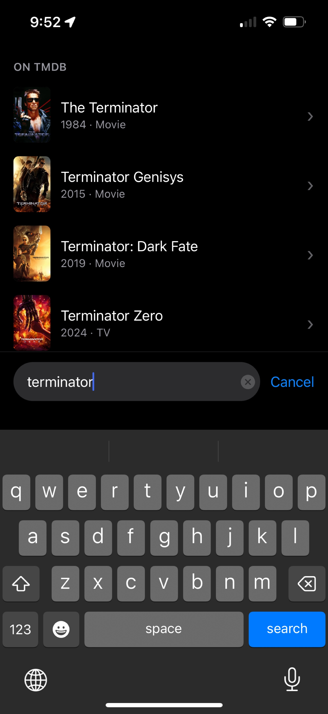
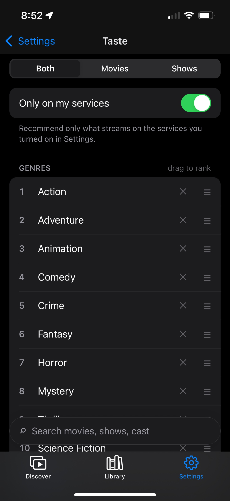
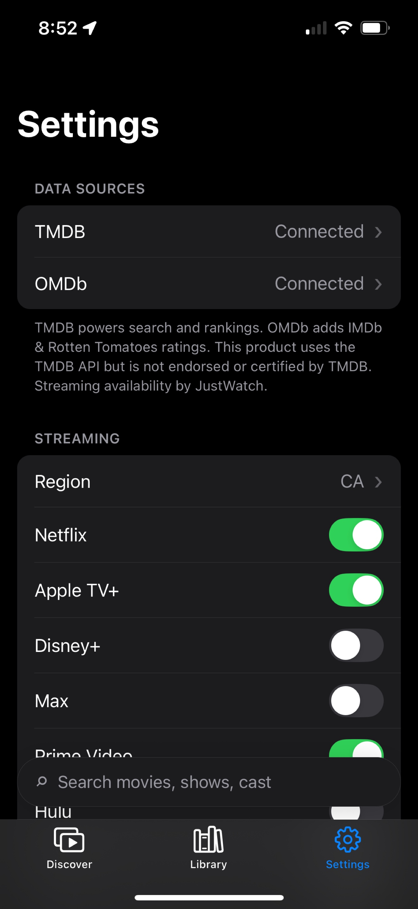

# What to Watch

Cross-platform (iOS/Android) React Native app for deciding what to watch — fuzzy search, per-streaming-platform rankings, and filters (rating, watch count, genre, year, region, language, cast) across your own notes/ratings and metadata pulled from TMDB/OMDb/IMDb.

## Stack

Bare React Native (TypeScript), React Navigation, Zustand, op-sqlite + Drizzle ORM, react-native-keychain, Fuse.js.

## Structure

- `src/providers` — TMDB/OMDb/IMDb metadata providers + merge/normalization
- `src/db` — local SQLite schema, client, repositories
- `src/state` — filter/sort and settings stores
- `src/screens`, `src/components` — Home (sections + persistent search + settings) and Show Detail
- `src/catalog` — fetch/cache titles, platform rankings, online search
- `src/backup` — local + iCloud Drive backup, import/export
- `src/native` — iCloud Drive and Spotlight bridges (iOS only)
- `src/demo`, `demo/` — demo mode and its preset library
- `deprecated/` — archived earlier backend scaffold, unused

## Local dev

```sh
npm install
cd ios && pod install && cd ..
npm run ios       # Release build → connected iPhone (no Metro server)
```

iOS signing: create gitignored `ios/Local.xcconfig` with your `DEVELOPMENT_TEAM` and `PRODUCT_BUNDLE_IDENTIFIER` (placeholders in `ios/Signing.xcconfig`). iCloud Drive backup needs a paid team; the container `iCloud.<bundle id>` is registered automatically with `-allowProvisioningUpdates`.

Install a release build on a connected iPhone:

```sh
cd ios
xcodebuild -workspace WhatToWatch.xcworkspace -scheme WhatToWatch -configuration Release \
  -destination 'generic/platform=iOS' -derivedDataPath build/dd -allowProvisioningUpdates build
xcrun devicectl device install app --device <UDID> build/dd/Build/Products/Release-iphoneos/WhatToWatch.app
```

Store region: `make ios STORE=cn` / `make release STORE=cn` (default `us` = Canada/US). Written to gitignored `ios/Install.xcconfig` → Info.plist `AppStoreRegion` → `storeRegion()` (`src/config/storeRegion.ts`). Plain `xcodebuild`/Xcode builds use the last one written, else `us`.

App Store: `make release` archives and uploads; every listing field, the privacy policy and the checklist are in `docs/release/`. `make help` lists the rest.

Import history: Settings → Import CSV… reads any CSV with a `title` column (optional `year, imdb, tmdb, type, status, rating (0.5–5), review, date`); IMDb and Letterboxd exports work as-is. A row with `tmdb` + `type` matches exactly.

Douban (no official export) → a CSV pinned to TMDB ids:

```sh
python3 scripts/douban-export.py <profile id> -o ~/Downloads/douban.csv
MATCH_CSV=~/Downloads/douban.csv MATCH_OUT=~/Downloads/douban-matched.csv npx jest scripts/match-csv.test.js
# misses only: IMDb ids from their Douban pages, then match again
python3 scripts/douban-export.py <profile id> -o ~/Downloads/douban.csv --from ~/Downloads/douban.csv \
  --imdb-for ~/Downloads/douban-matched.unmatched.csv
MATCH_CSV=~/Downloads/douban.csv MATCH_OUT=~/Downloads/douban-matched.csv npx jest scripts/match-csv.test.js
```

Import `douban-matched.csv`; `douban-matched.unmatched.csv` lists what TMDB doesn't have.

Live end-to-end test (real TMDB/OMDb, SQLite via `node:sqlite`) — keys from env or gitignored `.env.local` (`TMDB_API_KEY=…`, `OMDB_API_KEY=…`); skipped without them:

```sh
npx jest __tests__/liveApis.test.ts
```

Design + plan: `docs/design/mvp/`.

Add a TMDB and/or OMDb API key in the app's Settings section to enable metadata, ratings, and platform rankings.

## Demo

- Settings → Demo mode: own database and API-key slot; backups, iCloud and Spotlight stay off; switching back shows the real data untouched. "Reset demo data" starts over.
- Preset library: `demo/library.json` (backup format, dates shifted to today on first launch). Regenerate: `node scripts/make-demo-data.js`.
- Keys: `.env.demo` (copy `.env.demo.example`), baked in by `make ios` only (never `make release`); used only in demo mode. Order: key set in demo mode → `.env.demo` → real key (read only).
- Screenshots in demo mode: `DEMO=1 scripts/screenshot.sh discover /tmp/out.png` (`-demoMode 1` launch argument, that run only).

## Spotlight

Every cached title (library, browsed, rankings, picks) is indexed in iOS Spotlight via `CoreSpotlight`; tapping a result opens its page (`whattowatch://title/<id>`). Synced in the background as titles or the library change — only changed items are sent, everything again weekly.

## Screenshots

| **Discover** · picks for you, by service | **Title** · ratings, where to watch, your rating | **Library** · next watch, top rated |
|:-:|:-:|:-:|
|  |  |  |
| **Filters** · sort, type, year, rating, genre | **Search** · recent searches, tap to reuse | **Taste** · rank genres that drive picks |
|  |  |  |
| **Settings** · data sources, streaming services |  |  |
|  |  |  |
